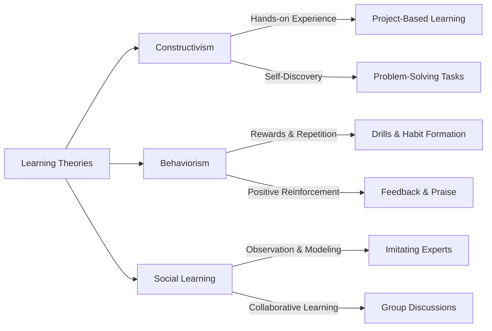

# **Cognitive Load Theory (CLT)**

## Overview  
Cognitive Theory explores how people **perceive, process, store, and apply knowledge**, shaping learning behaviors. In an educational context, it helps explain how students understand new information, retain knowledge, and solve problems.  

```mermaid
graph TD
  A[Cognitive Theory in Learning] -->|Perception| B(How students engage with information)
  A -->|Memory| C(How knowledge is stored & recalled)
  A -->|Problem-Solving| D(How students apply knowledge)
  A -->|Learning Processes| E(How understanding develops)

````
## 1. Perception 🧠  


---
## **2. Memory 🏛️**

**How learners encode, store, and retrieve information.**  
Memory plays a crucial role in learning retention and the ability to apply knowledge. Understanding how information moves through different memory stages helps optimize learning.

### **Breakdown:**

- **Encoding** – Converting new information into memory.
    
- **Storage** – Maintaining information over time.
    
- **Retrieval** – Accessing stored knowledge when needed.
    

---


```mermaid
flowchart TD
  A[Memory] -->|Encoding| B[Processing Information]
  B -->|Rehearsal & Meaning| C[Storage]
  C -->|Recall & Recognition| D[Retrieval]

  C -->|Short-Term Retention| E[Short-Term Memory]
  C -->|Long-Term Retention| F[Long-Term Memory]

  A -->|Immediate Sensory Input| G[Sensory Memory]
  G -->|Filtered & Transferred| E
  E -->|Strengthened via Repetition| F
```
----
<h3 style="text-align: center;">Examples</h3>
<h3 style="text-align: center;">Memory in Learning & Application</h3>


```dataviewjs
const memoryProcessesData = [
    {
        type: "📝 **Encoding**",
        examples: [
            "📖 **Active Learning:** A student takes lecture notes instead of just listening, improving retention.",
            "👨‍🍳 **Reinforcement Through Practice:** A chef memorizes a new recipe by cooking it multiple times, reinforcing the process."
        ]
    },
    {
        type: "🗂 **Storage (Short-Term vs. Long-Term Memory)**",
        examples: [
            "🕒 **Short-Term Memory:** A person remembers a Wi-Fi password long enough to enter it but forgets it later.",
            "🏥 **Long-Term Memory:** A doctor recalls medical procedures learned in school even years later."
        ]
    },
    {
        type: "🎯 **Retrieval (Recall & Recognition)**",
        examples: [
            "📅 **Recall:** A student remembers historical dates for an exam without prompts.",
            "🧑‍🤝‍🧑 **Recognition:** Seeing an old friend’s face and remembering their name without effort."
        ]
    }
];

dv.table(["💡 Memory Process", "📝 Examples"], 
    memoryProcessesData.map(row => [row.type, row.examples.join("<br>")])
);

```

<h3 style="text-align: center;">Learning Context (Making Memory Work)</h3>

#### **Repetition & [[0.3 Glossary#mnemonics|Mnemonics]]:**
```dataviewjs
const mnemonicsData = [
    {
        type: "🏥 **Medical Student**",
        examples: [
            "🧠 **Cranial Nerves Mnemonic:** Uses 'On Old Olympus' Towering Top, A Finn And German Viewed Some Hops' to recall *(Olfactory, Optic, Oculomotor, Trochlear, Trigeminal, Abducens, Facial, Auditory, Glossopharyngeal, Vagus, Spinal Accessory, Hypoglossal).*"
        ]
    },
    {
        type: "💊 **Pharmacy Student**",
        examples: [
            "💡 **Drug Classifications Mnemonic:** Recalls 'Silly Pharmacists Can Teach New Drugs' for *(Statins, Penicillins, Cephalosporins, Tetracyclines, NSAIDs, Diuretics).*"
        ]
    },
    {
        type: "⚖️ **Law Student**",
        examples: [
            "📜 **Contract Law Mnemonic:** Uses 'OACCL' to remember *(Offer, Acceptance, Consideration, Capacity, Legality).*"
        ]
    }
];

dv.table(["🎓 Field of Study", "📝 Mnemonic Examples"], 
    mnemonicsData.map(row => [row.type, row.examples.join("<br>")])
);

```

#### **Chunking & Associations:**
```dataviewjs
const chunkingData = [
    {
        type: "🔢 **Phone Number Recall**",
        examples: [
            "📞 **Breaking Numbers into Groups:** A person remembers '123-456-7890' more easily than a continuous 10-digit sequence."
        ]
    }
];

dv.table(["🧩 Memory Technique", "📝 Examples"], 
    chunkingData.map(row => [row.type, row.examples.join("<br>")])
);

```

---
## **3. Problem-Solving & Critical Thinking 🧩**


---
## **4. Learning Processes 📚**

_The way people learn is shaped by different processes. Understanding these helps create effective learning environments._

There are three major learning theories:

- **Constructivism** – Learners actively build knowledge from experience.
    
- **Behaviorism** – Learning is reinforced through rewards and repetition.
    
- **Social Learning** – Knowledge is gained through observing others.
    

---

### **Learning Theories in Action**

_Learning happens in different ways depending on the method used. Below are real-world examples of how these theories apply._

#### **Constructivism – Active Knowledge Building**

- 🏗️ **Engineering Student:** Instead of just reading blueprints, an apprentice **constructs a prototype** to understand structural stability. _Hands-on experimentation helps build understanding._
    
- 🏫 **Montessori Education:** Children **learn mathematics by manipulating physical objects** (e.g., using blocks to visualize addition). _Direct interaction strengthens comprehension._
    

#### **Behaviorism – Reinforcement & Repetition**

- 🎮 **Language Learning App:** A language app **rewards users with points** for daily practice, reinforcing learning through repetition. _Frequent rewards encourage consistent engagement._
    
- 🏋️ **Fitness Motivation:** A workout tracker **provides streak rewards** for completing consecutive exercise sessions. _Positive reinforcement strengthens habits._
    

#### **Social Learning – Learning Through Observation**

- ⚽ **Athlete Training:** A junior soccer player **imitates a professional’s technique** to improve dribbling skills. _Observation accelerates skill acquisition._
    
- 🏢 **Workplace Coaching:** A new employee **learns company procedures by watching experienced colleagues** handle tasks. _Modeling helps internalize best practices._

---

---