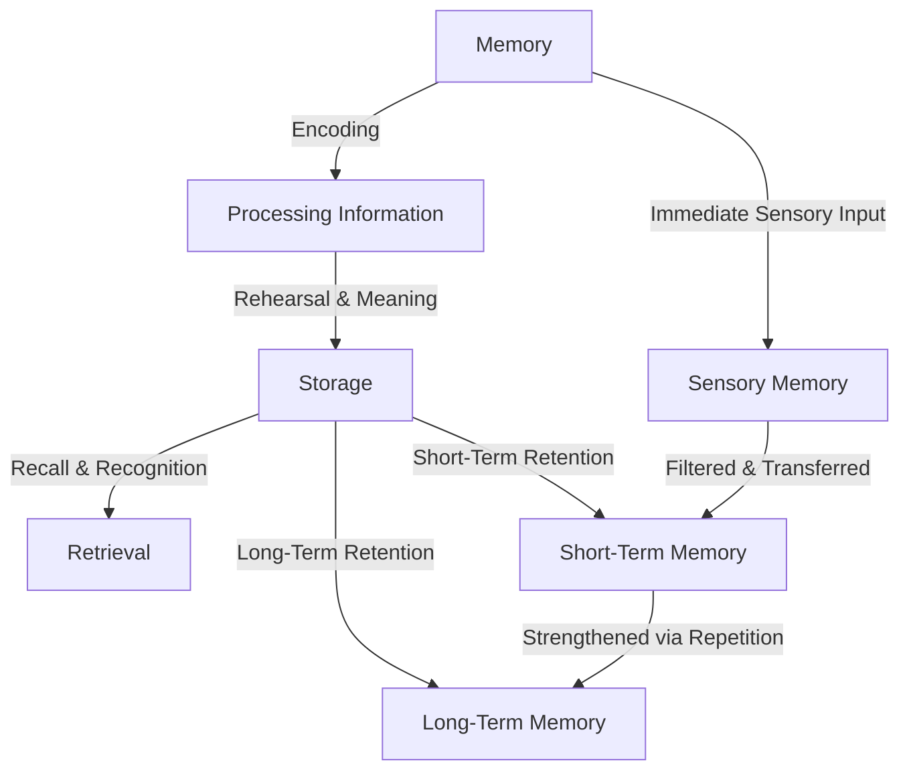
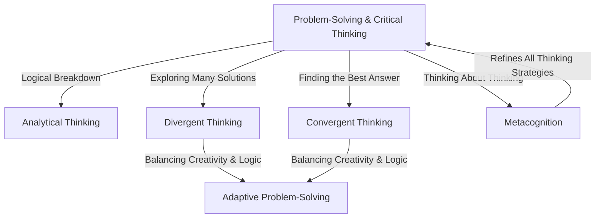
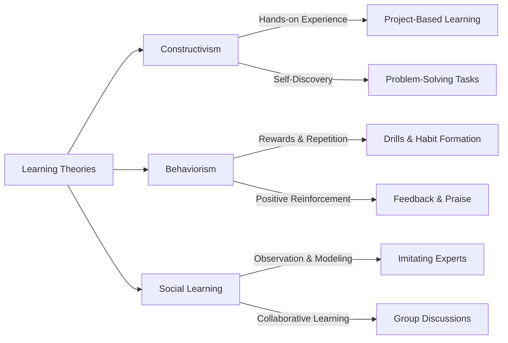

# **Cognitive Load Theory (CLT)**

## Overview  
Cognitive Theory explores how people **perceive, process, store, and apply knowledge**, shaping learning behaviors. In an educational context, it helps explain how students understand new information, retain knowledge, and solve problems.  

```mermaid
graph TD
  A[Cognitive Theory in Learning] -->|Perception| B(How students engage with information)
  A -->|Memory| C(How knowledge is stored & recalled)
  A -->|Problem-Solving| D(How students apply knowledge)
  A -->|Learning Processes| E(How understanding develops)

````
## 1. Perception 🧠  

**How learners interpret and engage with information.**  
Perception plays a major role in how students **filter, organize, and give meaning** to knowledge. It influences how we focus on relevant details and ignore distractions, shaping how effectively we learn.

### Breakdown:  

- **Top-Down Processing** – Interpretation based on prior knowledge, experiences, and expectations.  
- **Bottom-Up Processing** – Data-driven perception based purely on sensory input.  
- **Selective Attention** – Filtering out distractions to focus on learning.  

---

```mermaid center-flowchart
flowchart TD
  A[Perception] -->|Prior Knowledge| B[Top-Down Processing]
  A -->|New Information| C[Bottom-Up Processing]
  A -->|Focus & Filtering| D[Selective Attention]
  D -->|Maintaining focus over time| E[Sustained Attention]
  D -->|Switching between multiple tasks| F[Divided Attention]
  B & C -->|Hybrid Processing| G[Edge Case: Integrated Processing]
  ```
----
<h3 style="text-align: center;">Examples</h3>
<h3 style="text-align: center;">Perception in Learning & Work</h3>

```dataviewjs
const data = [
    {
        category: "**Top-Down Processing**",
        examples: [
            "📖 **Reading Handwriting:** A student quickly reads messy handwriting because they expect certain words in a sentence."
        ]
    },
    {
        category: "**Bottom-Up Processing**",
        examples: [
            "🗣️ **Language Learning:** A child learning a new language must process each unfamiliar word individually before understanding full sentences."
        ]
    },
    {
        category: "**Edge Case – Combined Processing**",
        examples: [
            "🎵 **Music Performance:** A musician playing a new piece uses bottom-up processing to read unfamiliar notes while top-down processing helps predict the melody based on musical patterns.",
            "🩺 **Medical Diagnosis:** A doctor diagnosing a patient uses bottom-up processing to analyze unfamiliar symptoms while top-down processing helps recognize patterns from past cases."
        ]
    }
];

dv.table(["🧠 Processing Type", "📝 Examples"], 
    data.map(row => [row.category, row.examples.join("<br>")])
);

```     

<h3 style="text-align: center;">Attention in Action</h3>

```dataviewjs
const data = [
    {
        category: "**Selective Attention**",
        examples: [
            "📖 **Focused Studying:** A student studying in a noisy café focuses on reading while ignoring background chatter."
        ]
    },
    {
        category: "**Sustained Attention**",
        examples: [
            "💻 **Programming for Hours:** A programmer writes code for hours without losing focus on syntax and logic."
        ]
    },
    {
        category: "**Divided Attention**",
        examples: [
            "👨‍🏫 **Multitasking in Teaching:** A teacher listens to a student’s question while writing on the board, processing both tasks simultaneously."
        ]
    }
];

dv.table(["🎯 Attention Type", "📝 Examples"], 
    data.map(row => [row.category, row.examples.join("<br>")])
);

```

---
## **2. Memory 🏛️**

**How learners encode, store, and retrieve information.**  
Memory plays a crucial role in learning retention and the ability to apply knowledge. Understanding how information moves through different memory stages helps optimize learning.

### **Breakdown:**

- **Encoding** – Converting new information into memory.
    
- **Storage** – Maintaining information over time.
    
- **Retrieval** – Accessing stored knowledge when needed.
    

---



----
<h3 style="text-align: center;">Examples</h3>
<h3 style="text-align: center;">Memory in Learning & Application</h3>


```dataviewjs
const memoryProcessesData = [
    {
        type: "📝 **Encoding**",
        examples: [
            "📖 **Active Learning:** A student takes lecture notes instead of just listening, improving retention.",
            "👨‍🍳 **Reinforcement Through Practice:** A chef memorizes a new recipe by cooking it multiple times, reinforcing the process."
        ]
    },
    {
        type: "🗂 **Storage (Short-Term vs. Long-Term Memory)**",
        examples: [
            "🕒 **Short-Term Memory:** A person remembers a Wi-Fi password long enough to enter it but forgets it later.",
            "🏥 **Long-Term Memory:** A doctor recalls medical procedures learned in school even years later."
        ]
    },
    {
        type: "🎯 **Retrieval (Recall & Recognition)**",
        examples: [
            "📅 **Recall:** A student remembers historical dates for an exam without prompts.",
            "🧑‍🤝‍🧑 **Recognition:** Seeing an old friend’s face and remembering their name without effort."
        ]
    }
];

dv.table(["💡 Memory Process", "📝 Examples"], 
    memoryProcessesData.map(row => [row.type, row.examples.join("<br>")])
);

```

<h3 style="text-align: center;">Learning Context (Making Memory Work)</h3>

#### **Repetition & [[0.3 Glossary#mnemonics|Mnemonics]]:**
```dataviewjs
const mnemonicsData = [
    {
        type: "🏥 **Medical Student**",
        examples: [
            "🧠 **Cranial Nerves Mnemonic:** Uses 'On Old Olympus' Towering Top, A Finn And German Viewed Some Hops' to recall *(Olfactory, Optic, Oculomotor, Trochlear, Trigeminal, Abducens, Facial, Auditory, Glossopharyngeal, Vagus, Spinal Accessory, Hypoglossal).*"
        ]
    },
    {
        type: "💊 **Pharmacy Student**",
        examples: [
            "💡 **Drug Classifications Mnemonic:** Recalls 'Silly Pharmacists Can Teach New Drugs' for *(Statins, Penicillins, Cephalosporins, Tetracyclines, NSAIDs, Diuretics).*"
        ]
    },
    {
        type: "⚖️ **Law Student**",
        examples: [
            "📜 **Contract Law Mnemonic:** Uses 'OACCL' to remember *(Offer, Acceptance, Consideration, Capacity, Legality).*"
        ]
    }
];

dv.table(["🎓 Field of Study", "📝 Mnemonic Examples"], 
    mnemonicsData.map(row => [row.type, row.examples.join("<br>")])
);

```

#### **Chunking & Associations:**
```dataviewjs
const chunkingData = [
    {
        type: "🔢 **Phone Number Recall**",
        examples: [
            "📞 **Breaking Numbers into Groups:** A person remembers '123-456-7890' more easily than a continuous 10-digit sequence."
        ]
    }
];

dv.table(["🧩 Memory Technique", "📝 Examples"], 
    chunkingData.map(row => [row.type, row.examples.join("<br>")])
);

```

---
## **3. Problem-Solving & Critical Thinking 🧩**

**How learners analyze information, evaluate solutions, and make decisions.**  
Problem-solving and critical thinking help learners **identify issues, assess information, and apply logical reasoning** to find solutions.

### **Breakdown:**

- **Analytical Thinking** – Breaking down problems into smaller parts for better understanding.
    
- **Divergent Thinking** "***Brainstorming***" – Exploring multiple solutions and creative approaches.
    
- **Convergent Thinking** – Narrowing down options to find the most effective solution.
    
- **Metacognition** – Thinking about one's own thinking process to improve problem-solving strategies.
    

---


----

<h3 style="text-align: center;">Examples</h3>
<h3 style="text-align: center;">Critical Thinking in Action</h3>

```dataviewjs
const data = [
    {
        type: "**Analytical Thinking**",
        examples: [
            "📊 **Financial Analysis:** Examining earnings reports by breaking them into revenue, costs, and profit margins.",
            "🔧 **Troubleshooting:** A mechanic isolates a car issue by testing battery, fuel system, and electrical connections."
        ]
    },
    {
        type: "**Divergent Thinking**",
        examples: [
            "🎮 **Game Design:** Brainstorming multiple endings for a story-driven game before choosing the best one.",
            "🔬 **Scientific Innovation:** Experimenting with different materials to find the most efficient solar panel."
        ]
    },
    {
        type: "**Convergent Thinking**",
        examples: [
            "⚖️ **Legal Strategy:** A lawyer selects the most persuasive argument after reviewing multiple options.",
            "👨‍🍳 **Menu Planning:** A chef tests different recipes but includes only the most appealing ones."
        ]
    },
    {
        type: "**Metacognition**",
        examples: [
            "📚 **Study Optimization:** A student reflects on past study methods and adjusts their approach.",
            "♟️ **Chess Strategy:** A chess player reviews past matches to refine future gameplay."
        ]
    }
];

dv.table(["💡 Thinking Type", "📝 Examples"], 
    data.map(row => [row.type, row.examples.join("<br>")])
);
```


<h3 style="text-align: center;">Edge Case – Adaptive Problem-Solving (Combining Divergent & Convergent Thinking)</h3>

Some situations **require both creative exploration and focused decision-making.**
```dataviewjs
const adaptiveProblemSolvingData = [
    {
        scenario: "🔥 **Firefighter in an Emergency**",
        divergent: "Considers multiple ways to enter a burning building safely.",
        convergent: "Chooses the best route based on safety conditions and urgency."
    },
    {
        scenario: "🧪 **Medical Researcher Developing a New Treatment**",
        divergent: "Tests various compounds and drug interactions.",
        convergent: "Identifies the one with the highest success rate and lowest side effects."
    },
    {
        scenario: "💻 **Software Engineer Debugging a Program**",
        divergent: "Explores different possible errors in the code.",
        convergent: "Finds and fixes the single most likely cause of the issue."
    },
    {
        scenario: "📰 **Journalist Writing an Investigative Report**",
        divergent: "Gathers multiple perspectives and sources.",
        convergent: "Focuses on the most relevant facts to present a clear, factual story."
    }
];

dv.table(["📌 Scenario", "🔍 Divergent Thinking", "🎯 Convergent Thinking"], 
    adaptiveProblemSolvingData.map(row => [row.scenario, row.divergent, row.convergent])
);
````


---
## **4. Learning Processes 📚**

_The way people learn is shaped by different processes. Understanding these helps create effective learning environments._

There are three major learning theories:

- **Constructivism** – Learners actively build knowledge from experience.
    
- **Behaviorism** – Learning is reinforced through rewards and repetition.
    
- **Social Learning** – Knowledge is gained through observing others.
    

---

### **Learning Theories in Action**

_Learning happens in different ways depending on the method used. Below are real-world examples of how these theories apply._

#### **Constructivism – Active Knowledge Building**

- 🏗️ **Engineering Student:** Instead of just reading blueprints, an apprentice **constructs a prototype** to understand structural stability. _Hands-on experimentation helps build understanding._
    
- 🏫 **Montessori Education:** Children **learn mathematics by manipulating physical objects** (e.g., using blocks to visualize addition). _Direct interaction strengthens comprehension._
    

#### **Behaviorism – Reinforcement & Repetition**

- 🎮 **Language Learning App:** A language app **rewards users with points** for daily practice, reinforcing learning through repetition. _Frequent rewards encourage consistent engagement._
    
- 🏋️ **Fitness Motivation:** A workout tracker **provides streak rewards** for completing consecutive exercise sessions. _Positive reinforcement strengthens habits._
    

#### **Social Learning – Learning Through Observation**

- ⚽ **Athlete Training:** A junior soccer player **imitates a professional’s technique** to improve dribbling skills. _Observation accelerates skill acquisition._
    
- 🏢 **Workplace Coaching:** A new employee **learns company procedures by watching experienced colleagues** handle tasks. _Modeling helps internalize best practices._

---

---