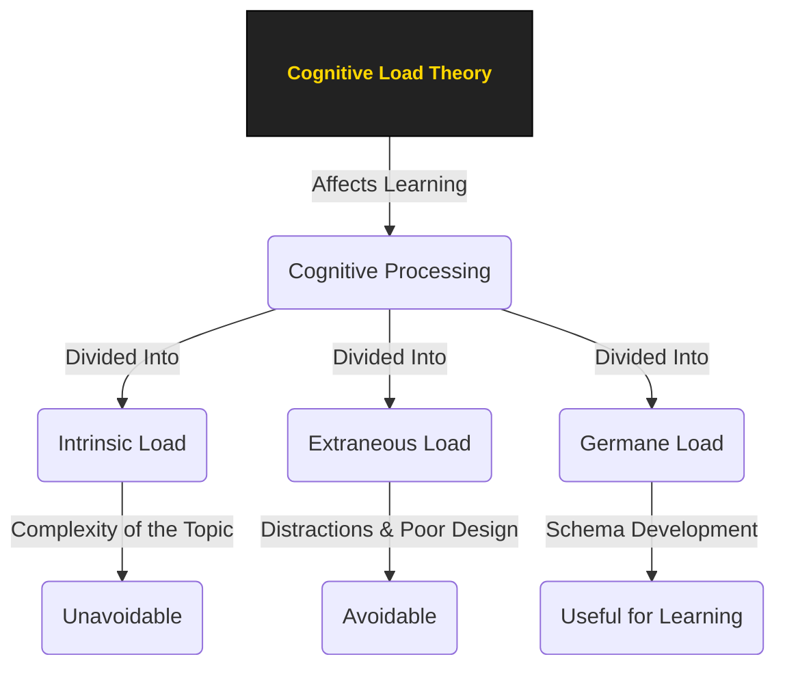
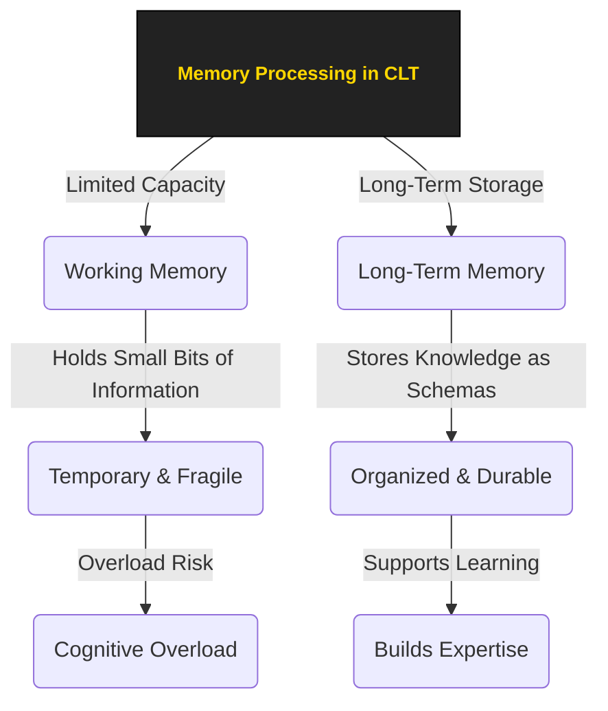
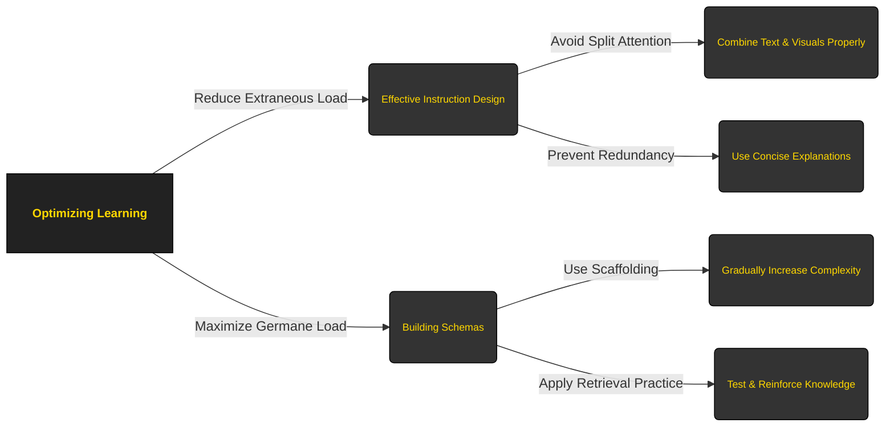

## Overview  
Cognitive Theory explores how people **perceive, process, store, and apply knowledge**, shaping learning behaviors. In an educational context, it helps explain how students understand new information, retain knowledge, and solve problems.

However, learning is not just about acquiring knowledge—it involves complex mental processes that can either facilitate or hinder understanding. This is where **Cognitive Load Theory (CLT)** plays a crucial role. CLT examines how the brain manages information during learning and how excessive cognitive demands can impede comprehension.

---

### Core structure

This section introduces key aspects of CLT and how it applies to learning environments:

- **[[1. Persception|Perception & Attention]]** – How learners engage with information and filter relevant details.
    
- **[[2. Memory|Memory Processes]]** – How knowledge is stored and recalled.
    
- **[[3. Problem-Solving & Critical Thinking|Problem-Solving & Application]]** – How learners apply knowledge in real-world contexts.
    
- **[[4. Learning Processes|Cognitive Load & Learning Efficiency]]** – How different types of cognitive load impact learning.
    

By understanding these principles, educators and instructional designers can optimize learning environments, reducing unnecessary cognitive strain and improving knowledge retention.

```mermaid
graph LR
  classDef important fill:#333333, stroke:#000000, color:#FFD700, font-size:12px, font-weight:bold, margin:2px;
  classDef secondary fill:#333333, stroke:#000000, color:#FFD700, font-size:12px, margin:2px;

  A[Cognitive Load Theory]:::important
  A -->|Perception & Attention| B(Engagement with Information):::secondary
  A -->|Memory Processes| C(Storage & Recall of Knowledge):::secondary
  A -->|Problem-Solving & Application| D(Applying Knowledge):::secondary
  A -->|Cognitive Load & Learning Efficiency| E(Managing Cognitive Strain):::secondary

````

_"Developed by John Sweller in the 1980s, Cognitive Load Theory (CLT) examines the limits of our brain’s processing abilities. It explains how learners take in, store, and apply new information. Understanding CLT is key to improving teaching strategies, enhancing learning experiences, and making self-study more effective."_

---


## Key Aspects
Understanding Cognitive Load Theory is just the first step—its real value lies in how it explains different learning challenges and how we can optimize the learning process. 

The following key aspects explore how cognitive load interacts with **memory, attention, expertise, and task complexity**, influencing both learning success and failure. 

By understanding these principles, we can design better learning environments, avoid common pitfalls, and develop strategies that make learning more efficient and less overwhelming.

### **1. Working Memory & Long-Term Memory**

### **2. Schema Theory**

Schemas are **mental frameworks** that organize knowledge, helping us recognize patterns and make sense of new information efficiently. 
They store both **declarative (“what”) knowledge**, such as facts and concepts, and **procedural (“how”) knowledge**, like skills and processes.

#### **Example**

When you enter a restaurant, you don’t need to relearn how it works each time—you already know there will be a menu, a server, and a bill at the end. This mental framework helps you navigate the experience without excessive cognitive effort.

#### **Application**

Teachers and learners can leverage schemas by:

- **Building on prior knowledge** – Connecting new concepts to familiar ones makes learning easier.
    
- **Using analogies and real-world examples** – Framing new material within an existing schema enhances understanding.
    
- **Encouraging active recall** – Strengthening schemas through retrieval practice improves retention.
    

#### **Conclusion:**  
Schemas act as a **bridge between working memory and long-term memory**, allowing us to process information efficiently. As schemas develop, learning becomes faster and more automatic.

[[0.2 Schema Theory|Mnemonic]] device demonstrates how Schema Theory is applied in the real-world and it's practices.

---
### **3. Types of Cognitive Load**  
Learning is influenced by **three types of cognitive load**, which determine how easily we process new information. Understanding these types helps educators design more effective learning experiences.

#### **3.1 [[0.3 Glossary#Intrinsic|Intrinsic]] Cognitive Load**

This refers to the inherent difficulty of the material being learned. The more complex the content, the higher the intrinsic load.

- **Example**: Learning algebra involves high intrinsic cognitive load because it requires understanding variables, equations, and mathematical rules.
    
- **Application**: A teacher could break down complex math problems into smaller, more manageable steps to reduce the intrinsic load.

"While intrinsic cognitive load is determined by the complexity of the material itself, the way information is presented can either ease or increase the learner’s burden. This is where **extraneous cognitive load** comes into play—unnecessary mental effort caused by poor design, distractions, or inefficient teaching methods."

#### **3.2 [[0.3 Glossary#extraneous|Extraneous]] Cognitive Load**

Extraneous cognitive load refers to the **unnecessary mental effort** caused by **poor instructional design, distractions, or inefficient teaching methods**. Unlike intrinsic load, which is unavoidable, extraneous load can and should be minimized to improve learning efficiency.

- **Example**: Trying to learn a new language using a confusing app that bombards the user with irrelevant ads or poorly structured lessons increases extraneous load, making learning more difficult than necessary.
    
- **Application**: Teachers and instructional designers should **eliminate unnecessary distractions** and ensure materials are **clear, well-structured, and easy to follow**. Simplified layouts, intuitive navigation, and removing redundant content all help in reducing extraneous load.

"By reducing extraneous cognitive load, we free up mental resources for meaningful learning. But what happens when cognitive effort is directed toward deeper understanding and skill development? This is where **germane cognitive load** comes into play—helping learners actively engage with new information and integrate it into their existing knowledge."

#### **3.3 [[0.3 Glossary#Germane|Germane]] Cognitive Load**

Germane cognitive load refers to the **mental effort dedicated to processing, understanding, and integrating new knowledge**. Unlike extraneous load, which is **wasteful**, germane load is **productive**—it strengthens learning by helping students form **schemas** (mental structures that organize knowledge).

- **Example**: When a student learns to apply algebra to real-world scenarios (e.g., budgeting or engineering problems), their brain actively works to integrate new knowledge with existing concepts, enhancing long-term retention.
    
- **Application**: Encouraging **active learning strategies** such as problem-solving, discussions, and real-world applications helps increase germane load in a productive way. Well-designed instructional materials should support **schema formation** rather than just memorization.

_"Maximizing germane cognitive load is key to deep learning. By shifting cognitive effort away from unnecessary distractions and toward meaningful connections, learners can strengthen their understanding and retention of knowledge. With this, we can now see how balancing all three types of cognitive load leads to an optimized learning experience."_

---
Cognitive Load Theory provides a framework for understanding how the brain processes information during learning. By managing intrinsic load, reducing extraneous load, and fostering germane load, educators and learners can create more effective and engaging learning experiences. Whether in classrooms, self-study, or instructional design, applying CLT principles helps unlock the full potential of knowledge acquisition and skill development.

*[[0.3 Cognative Load|Mnemonic]]* device demonstrates how important cognitive load is through real-life case study.

---
### **4. Split-Attention Effect & Redundancy Principle**

Poor instructional design can **increase extraneous load** unnecessarily. Two key issues are:

1. **Split-Attention Effect**: When learners have to divide their attention between multiple sources of information (e.g., reading text while looking at a disconnected diagram).
    
2. **Redundancy Principle**: Too much duplicated or unnecessary information can slow learning instead of helping.
    

#### **Example**

Imagine you're assembling furniture using a manual that provides separate text instructions and an unlabeled diagram on different pages. You must constantly switch between them, trying to match the text with the correct parts—this increases cognitive load.

Alternatively, if the manual integrates short, clear instructions directly onto the diagram, your attention is focused, making assembly easier.

#### **Application**

- **Minimize Split Attention**: Combine visuals and text meaningfully, like labeling diagrams or embedding key explanations into images.
    
- **Avoid Redundant Information**: Instead of reading slides verbatim, summarize key points and use spoken explanations.
    
- **Use Integrated Formats**: Infographics, annotated images, and well-structured content can guide attention without overwhelming learners.
    

Minimizing split attention and redundancy is crucial for beginners, but as learners **gain expertise**, their needs change. Instructional strategies that help novices can become inefficient or even **hinder learning** for experts. This shift is explained by the **Expertise Reversal Effect**, which highlights the importance of adapting instruction to a learner’s skill level.


[[0.4 Split-Attention Effect & Redundancy Principle|Mnemonic]] device.


---
### **5. Expertise Reversal Effect**

As learners become more skilled, instructional techniques that once helped them **can become a burden**. The **Expertise Reversal Effect** describes how strategies effective for beginners may no longer support advanced learners and can even **increase cognitive load**.

####  **Example:**

1. A beginner programmer benefits from **step-by-step coding tutorials**, while an expert finds them **slow and unnecessary**, preferring **concise documentation** instead.
    
2. A math student initially needs **detailed worked examples**, but over time, these **become redundant**, and solving problems independently is more effective.
    

####  **Application:**

To optimize learning, instruction should **adapt** to the learner’s expertise. This means:

- Using **explicit guidance** for beginners.
    
- Gradually **reducing support** as learners become proficient.
    
- Providing **problem-solving opportunities** instead of excessive explanations for advanced learners.

As expertise grows, the way we **process and handle information** changes. The **Expertise Reversal Effect** highlights the importance of adapting instructional methods to a learner’s skill level—ensuring neither too much nor too little guidance.

However, not all learning tasks are equal. Some involve **simple, isolated elements**, while others require handling **multiple interconnected pieces at once**. This leads us to the next key aspect: **Element Interactivity & Task Complexity**.
    
[[0.5 Expertise Reversal Effect|Mnemonic]] device

---

### **6. Element Interactivity & Task Complexity**

Some topics are naturally **more complex** than others because they require learners to process **multiple elements simultaneously**.

#### **High vs. Low Element Interactivity**

- **High Element Interactivity**: Requires learners to understand relationships between multiple concepts at once (e.g., solving a physics problem).
    
- **Low Element Interactivity**: Concepts can be learned individually without too much interaction (e.g., memorizing historical dates).
    

#### **Why It Matters?**

- **Overload risk**: If too many interdependent elements are introduced at once, it overwhelms working memory.
    
- **Scaffolding is key**: Teachers should **gradually introduce complexity** to ease cognitive strain.
    

#### **Real-Life Examples**

#### **1. Learning a New Language**

- **Low Interactivity:** Memorizing vocabulary words individually.
    
- **High Interactivity:** Constructing full sentences that require grammar, structure, and meaning to work together.
    

#### **2. Solving a Math Problem**

- **Low Interactivity:** Practicing simple multiplication.
    
- **High Interactivity:** Solving an algebra problem that requires multiple operations in sequence.

When learning tasks involve **high element interactivity**, they can quickly become overwhelming if not introduced progressively. Managing task complexity helps learners **avoid cognitive overload**, where too much information exceeds working memory capacity.

This brings us to the next challenge: **Cognitive Overload & Burnout**—what happens when learning demands surpass our cognitive limits and how we can prevent it.

[[0.6 Element Interactivity & Task Complexity|Mnemonic]] device.

---
### **7. Cognitive Overload & Burnout**
When the brain is overwhelmed with **too much information** or **poorly structured learning**, cognitive overload occurs. This can lead to:

- **Mental Fatigue** – The brain struggles to process new material.
    
- **Frustration & Stress** – Learning becomes exhausting instead of engaging.
    
- **Ineffective Retention** – Information fails to transfer to long-term memory.
    
- **Burnout** – Sustained overload leads to exhaustion and disengagement.
    

---

#### **Real-Life Example:**

**Cramming for an Exam**

- **Scenario:** A student spends several hours the night before the exam trying to study all the material at once.
    
- **Effect on Cognitive Load:** The information load is too much for working memory to handle, as there is no time for consolidation in long-term memory.
    
- **Impact:** The student feels mentally exhausted, experiences high levels of stress, and retains little information for the exam.
    
- **Lesson:** Proper pacing and studying over time rather than cramming can prevent overload.

**Workplace Overload**

- **Scenario:** A new employee is asked to complete multiple complex tasks on their first day at a job.
    
- **Effect on Cognitive Load:** The tasks are complex (intrinsic load), but without proper guidance or breaks (extraneous load), the total cognitive load overwhelms the employee.
    
- **Impact:** The employee struggles with understanding the tasks, leading to frustration and a decline in productivity. Over time, this could lead to burnout.
    
- **Lesson:** Proper onboarding, task breakdowns, and support reduce overload and ensure a smoother learning curve.
    
---

#### **Why It Matters?**

Cognitive overload can hinder learning and cause burnout. To avoid this, learning should be **paced appropriately**, with **breaks** and **manageable chunks** to prevent overwhelming the brain.

Cognitive overload significantly impedes the learning process, leading to frustration, fatigue, and poor retention. By recognizing the signs of overload, learners and educators can implement strategies to manage cognitive load effectively, ensuring better learning outcomes. With the right pacing, structure, and breaks, the risk of burnout and ineffective learning can be minimized.

### **8. Learning Strategies That Work with CLT**
To **reduce extraneous load** and **maximize germane load**, learners can use structured strategies that enhance retention and understanding.

---

#### **Key Learning Strategies**

1. **Chunking** – Breaking down information into smaller, manageable parts.
    
2. **Scaffolding** – Gradually increasing complexity with guided support.
    
3. **Dual Coding** – Combining visuals and text to strengthen understanding.
    
4. **Interleaving** – Mixing different topics or problem types to reinforce learning.
    
5. **Retrieval Practice** – Actively recalling information to improve memory.
    

---

#### Examples: 

**Learning a New Math Concept**

To effectively grasp a new math topic, structured learning strategies help manage cognitive load and improve retention.

1. **Chunking** – The teacher introduces algebra step by step, starting with variables before moving to equations.
    
2. **Scaffolding** – Students begin with guided problem-solving before gradually working independently.
    
3. **Dual Coding** – Equations are paired with graphs and diagrams to reinforce understanding.
    
4. **Interleaving** – Different types of algebra problems are mixed to strengthen problem-solving skills.
    
5. **Retrieval Practice** – Students quiz themselves and solve problems without looking at notes.

**Cooking a New Recipe**

Imagine learning to cook a new dish for the first time:

1. **Chunking** – You start by prepping ingredients separately (chopping vegetables, measuring spices).
    
2. **Scaffolding** – You follow a step-by-step recipe, relying on detailed instructions.
    
3. **Dual Coding** – You watch a cooking video while reading the written instructions.
    
4. **Interleaving** – Over time, you practice different cooking techniques across recipes.
    
5. **Retrieval Practice** – After making the dish a few times, you try cooking it from memory.

---

# TO DO:
---
### **1. Overview of Cognitive Load Theory**

This flowchart will introduce the **core idea** and three types of cognitive load.



### **2. Memory & Information Processing**

This flowchart focuses on **how memory works** within CLT.



### **3. Application & Learning Strategies**

This chart connects **CLT to effective teaching strategies**.



