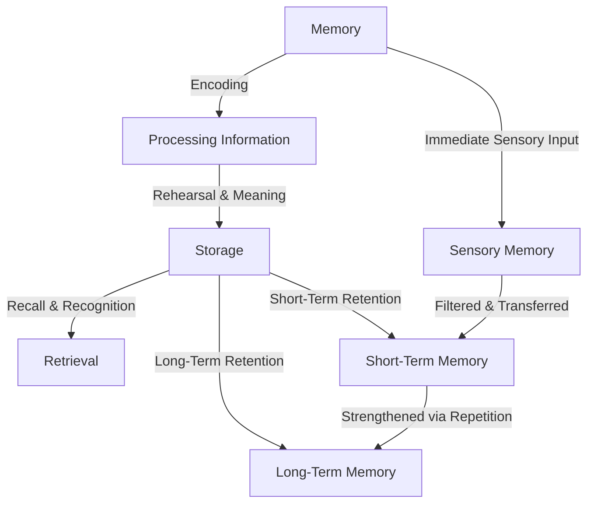

**How learners encode, store, and retrieve information.**  
Memory plays a crucial role in learning retention and the ability to apply knowledge. Understanding how information moves through different memory stages helps optimize learning.

### **Breakdown:**

- **Encoding** – Converting new information into memory.
    
- **Storage** – Maintaining information over time.
    
- **Retrieval** – Accessing stored knowledge when needed.
    

---



----
<h3 style="text-align: center;">Examples</h3>
<h3 style="text-align: center;">Memory in Learning & Application</h3>


```dataviewjs
const memoryProcessesData = [
    {
        type: "📝 **Encoding**",
        examples: [
            "📖 **Active Learning:** A student takes lecture notes instead of just listening, improving retention.",
            "👨‍🍳 **Reinforcement Through Practice:** A chef memorizes a new recipe by cooking it multiple times, reinforcing the process."
        ]
    },
    {
        type: "🗂 **Storage (Short-Term vs. Long-Term Memory)**",
        examples: [
            "🕒 **Short-Term Memory:** A person remembers a Wi-Fi password long enough to enter it but forgets it later.",
            "🏥 **Long-Term Memory:** A doctor recalls medical procedures learned in school even years later."
        ]
    },
    {
        type: "🎯 **Retrieval (Recall & Recognition)**",
        examples: [
            "📅 **Recall:** A student remembers historical dates for an exam without prompts.",
            "🧑‍🤝‍🧑 **Recognition:** Seeing an old friend’s face and remembering their name without effort."
        ]
    }
];

dv.table(["💡 Memory Process", "📝 Examples"], 
    memoryProcessesData.map(row => [row.type, row.examples.join("<br>")])
);

```

<h3 style="text-align: center;">Learning Context (Making Memory Work)</h3>

#### **Repetition & [[0.3 Glossary#mnemonics|Mnemonics]]:**
```dataviewjs
const mnemonicsData = [
    {
        type: "🏥 **Medical Student**",
        examples: [
            "🧠 **Cranial Nerves Mnemonic:** Uses 'On Old Olympus' Towering Top, A Finn And German Viewed Some Hops' to recall *(Olfactory, Optic, Oculomotor, Trochlear, Trigeminal, Abducens, Facial, Auditory, Glossopharyngeal, Vagus, Spinal Accessory, Hypoglossal).*"
        ]
    },
    {
        type: "💊 **Pharmacy Student**",
        examples: [
            "💡 **Drug Classifications Mnemonic:** Recalls 'Silly Pharmacists Can Teach New Drugs' for *(Statins, Penicillins, Cephalosporins, Tetracyclines, NSAIDs, Diuretics).*"
        ]
    },
    {
        type: "⚖️ **Law Student**",
        examples: [
            "📜 **Contract Law Mnemonic:** Uses 'OACCL' to remember *(Offer, Acceptance, Consideration, Capacity, Legality).*"
        ]
    }
];

dv.table(["🎓 Field of Study", "📝 Mnemonic Examples"], 
    mnemonicsData.map(row => [row.type, row.examples.join("<br>")])
);

```

#### **Chunking & Associations:**
```dataviewjs
const chunkingData = [
    {
        type: "🔢 **Phone Number Recall**",
        examples: [
            "📞 **Breaking Numbers into Groups:** A person remembers '123-456-7890' more easily than a continuous 10-digit sequence."
        ]
    }
];

dv.table(["🧩 Memory Technique", "📝 Examples"], 
    chunkingData.map(row => [row.type, row.examples.join("<br>")])
);

```
