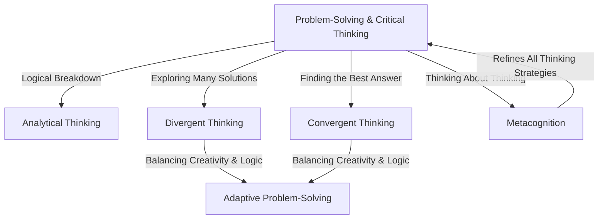

**How learners analyze information, evaluate solutions, and make decisions.**  
Problem-solving and critical thinking help learners **identify issues, assess information, and apply logical reasoning** to find solutions.

### **Breakdown:**

- **Analytical Thinking** – Breaking down problems into smaller parts for better understanding.
    
- **Divergent Thinking** "***Brainstorming***" – Exploring multiple solutions and creative approaches.
    
- **Convergent Thinking** – Narrowing down options to find the most effective solution.
    
- **Metacognition** – Thinking about one's own thinking process to improve problem-solving strategies.
    

---


----

<h3 style="text-align: center;">Examples</h3>
<h3 style="text-align: center;">Critical Thinking in Action</h3>

```dataviewjs
const data = [
    {
        type: "**Analytical Thinking**",
        examples: [
            "📊 **Financial Analysis:** Examining earnings reports by breaking them into revenue, costs, and profit margins.",
            "🔧 **Troubleshooting:** A mechanic isolates a car issue by testing battery, fuel system, and electrical connections."
        ]
    },
    {
        type: "**Divergent Thinking**",
        examples: [
            "🎮 **Game Design:** Brainstorming multiple endings for a story-driven game before choosing the best one.",
            "🔬 **Scientific Innovation:** Experimenting with different materials to find the most efficient solar panel."
        ]
    },
    {
        type: "**Convergent Thinking**",
        examples: [
            "⚖️ **Legal Strategy:** A lawyer selects the most persuasive argument after reviewing multiple options.",
            "👨‍🍳 **Menu Planning:** A chef tests different recipes but includes only the most appealing ones."
        ]
    },
    {
        type: "**Metacognition**",
        examples: [
            "📚 **Study Optimization:** A student reflects on past study methods and adjusts their approach.",
            "♟️ **Chess Strategy:** A chess player reviews past matches to refine future gameplay."
        ]
    }
];

dv.table(["💡 Thinking Type", "📝 Examples"], 
    data.map(row => [row.type, row.examples.join("<br>")])
);
```


<h3 style="text-align: center;">Edge Case – Adaptive Problem-Solving (Combining Divergent & Convergent Thinking)</h3>

Some situations **require both creative exploration and focused decision-making.**
```dataviewjs
const adaptiveProblemSolvingData = [
    {
        scenario: "🔥 **Firefighter in an Emergency**",
        divergent: "Considers multiple ways to enter a burning building safely.",
        convergent: "Chooses the best route based on safety conditions and urgency."
    },
    {
        scenario: "🧪 **Medical Researcher Developing a New Treatment**",
        divergent: "Tests various compounds and drug interactions.",
        convergent: "Identifies the one with the highest success rate and lowest side effects."
    },
    {
        scenario: "💻 **Software Engineer Debugging a Program**",
        divergent: "Explores different possible errors in the code.",
        convergent: "Finds and fixes the single most likely cause of the issue."
    },
    {
        scenario: "📰 **Journalist Writing an Investigative Report**",
        divergent: "Gathers multiple perspectives and sources.",
        convergent: "Focuses on the most relevant facts to present a clear, factual story."
    }
];

dv.table(["📌 Scenario", "🔍 Divergent Thinking", "🎯 Convergent Thinking"], 
    adaptiveProblemSolvingData.map(row => [row.scenario, row.divergent, row.convergent])
);
````


