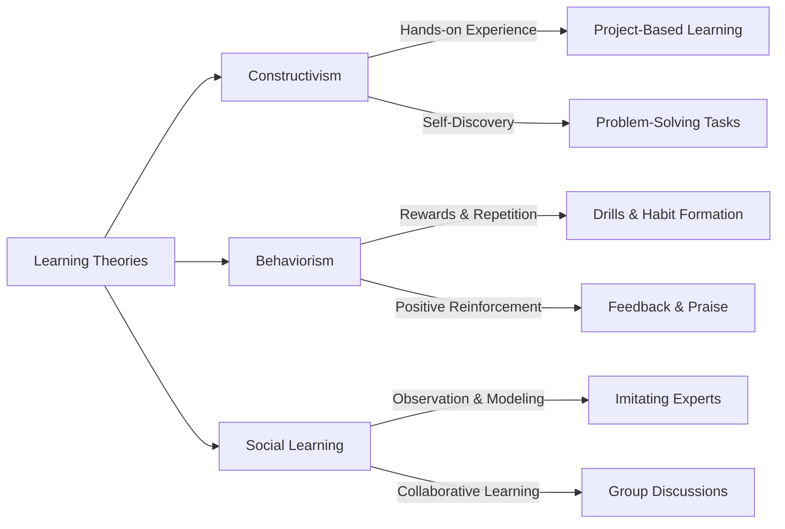

_The way people learn is shaped by different processes. Understanding these helps create effective learning environments._

There are three major learning theories:

- **Constructivism** – Learners actively build knowledge from experience.
    
- **Behaviorism** – Learning is reinforced through rewards and repetition.
    
- **Social Learning** – Knowledge is gained through observing others.
    

---

### **Learning Theories in Action**

_Learning happens in different ways depending on the method used. Below are real-world examples of how these theories apply._

#### **Constructivism – Active Knowledge Building**

- 🏗️ **Engineering Student:** Instead of just reading blueprints, an apprentice **constructs a prototype** to understand structural stability. _Hands-on experimentation helps build understanding._
    
- 🏫 **Montessori Education:** Children **learn mathematics by manipulating physical objects** (e.g., using blocks to visualize addition). _Direct interaction strengthens comprehension._
    

#### **Behaviorism – Reinforcement & Repetition**

- 🎮 **Language Learning App:** A language app **rewards users with points** for daily practice, reinforcing learning through repetition. _Frequent rewards encourage consistent engagement._
    
- 🏋️ **Fitness Motivation:** A workout tracker **provides streak rewards** for completing consecutive exercise sessions. _Positive reinforcement strengthens habits._
    

#### **Social Learning – Learning Through Observation**

- ⚽ **Athlete Training:** A junior soccer player **imitates a professional’s technique** to improve dribbling skills. _Observation accelerates skill acquisition._
    
- 🏢 **Workplace Coaching:** A new employee **learns company procedures by watching experienced colleagues** handle tasks. _Modeling helps internalize best practices._

---
